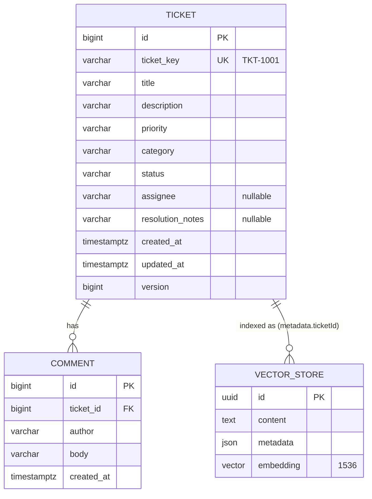

# Data Model
Status: Reviewed
Traces to: FR-1..FR-16, NFR-2, OQ-1, OQ-6, OQ-10, OQ-17, ADR-1, ADR-3

## 1. Entity relationship

`vector_store` has no foreign key to `ticket`: it is owned by Spring AI's `PgVectorStore` and linked by `metadata.ticketId`. Tickets are never deleted (OS-7), so no orphan clean-up is needed.

## 2. Tables

### 2.1 `ticket`

| Column | Type | Null | Constraint / default | Source |
|---|---|---|---|---|
| `id` | `BIGINT GENERATED ALWAYS AS IDENTITY` | no | PK | |
| `ticket_key` | `VARCHAR(20)` | no | `UNIQUE`; `'TKT-' || nextval('ticket_key_seq')` assigned by the service | glossary |
| `title` | `VARCHAR(200)` | no | | §2.4 |
| `description` | `VARCHAR(5000)` | no | | §2.4 |
| `priority` | `VARCHAR(10)` | no | `CHECK IN ('LOW','MEDIUM','HIGH','CRITICAL')` | OQ-10 |
| `category` | `VARCHAR(20)` | no | `CHECK IN ('PAYMENT','SHIPPING','ACCOUNT','TECHNICAL','OTHER')` | OQ-10 |
| `status` | `VARCHAR(20)` | no | `CHECK IN ('OPEN','IN_PROGRESS','RESOLVED','CLOSED','CANCELLED')`, default `'OPEN'` | §4 |
| `assignee` | `VARCHAR(100)` | yes | null = unassigned | FR-5 |
| `resolution_notes` | `VARCHAR(5000)` | yes | required (non-blank) before RESOLVED — enforced in the domain, not the DB | OQ-1 |
| `created_at` | `TIMESTAMPTZ` | no | set on insert (UTC) | |
| `updated_at` | `TIMESTAMPTZ` | no | set on every update, including a new comment | |
| `version` | `BIGINT` | no | default 0; JPA `@Version` optimistic locking | |

Indexes: `ux_ticket_key` (unique), `ix_ticket_status (status)`, `ix_ticket_created_at (created_at DESC)`.

Sequence: `CREATE SEQUENCE ticket_key_seq START WITH 1001`. The service reads `nextval` before insert, so the key is known before the entity is saved and appears in the event.

Keyword search (OQ-7): `lower(title) LIKE %kw% OR lower(description) LIKE %kw%` — a sequential scan is fine at this scale; a `pg_trgm` GIN index is the upgrade path.

String columns use `VARCHAR(n)` (not `TEXT`) so `spring.jpa.hibernate.ddl-auto=validate` matches the entity's `@Column(length = n)`.

### 2.2 `comment`

| Column | Type | Null | Constraint |
|---|---|---|---|
| `id` | `BIGINT GENERATED ALWAYS AS IDENTITY` | no | PK |
| `ticket_id` | `BIGINT` | no | FK → `ticket(id)` `ON DELETE CASCADE` |
| `author` | `VARCHAR(100)` | no | OQ-17 |
| `body` | `VARCHAR(2000)` | no | §2.4 |
| `created_at` | `TIMESTAMPTZ` | no | set on insert |

Index: `ix_comment_ticket (ticket_id, created_at)`. Append-only: there is no update or delete path (OQ-6).

### 2.3 `vector_store`

Structure required by Spring AI `PgVectorStore`; created by Flyway (ADR-3), with `initialize-schema=false`.

| Column | Type | Notes |
|---|---|---|
| `id` | `UUID` PK | Deterministic, supplied by the app: `UUID.nameUUIDFromBytes("<ticketKey>#<chunkType>#<index>")` |
| `content` | `TEXT` | Chunk text including its header line (ADR-1) |
| `metadata` | `JSON` | See §3 |
| `embedding` | `VECTOR(1536)` | Must equal `spring.ai.vectorstore.pgvector.dimensions` |

Index: `ix_vector_store_embedding USING hnsw (embedding vector_cosine_ops)`.

## 3. Chunk metadata (FR-15)

| Key | Type | Example | Notes |
|---|---|---|---|
| `ticketId` | string | `"TKT-1001"` | PDF name; the value is the ticket **key** |
| `status` | string | `"RESOLVED"` | |
| `priority` | string | `"HIGH"` | |
| `assignee` | string | `"Priya Sharma"` / `"unassigned"` | Spring AI `Document` metadata may not hold `null`, so unassigned is the literal `"unassigned"` |
| `category` | string | `"PAYMENT"` | |
| `title` | string | `"Card payments failing at checkout"` | lets citations show a title without a DB round-trip |
| `chunkType` | string | `"SUMMARY"` / `"COMMENTS"` | ADR-1 |
| `chunkIndex` | int | `0` | position within the chunk type |
| `updatedAt` | string (ISO-8601) | `"2026-09-25T10:15:30Z"` | ticket's `updated_at` at indexing time |

## 4. Migrations (Flyway, `backend/src/main/resources/db/migration`)

| File | Content |
|---|---|
| `V1__ticket_and_comment.sql` | `ticket_key_seq`, `ticket`, `comment`, indexes, check constraints |
| `V2__vector_store.sql` | `CREATE EXTENSION IF NOT EXISTS vector` (no-op: a superuser created it during setup), `vector_store` table and HNSW index |

Seed data is **not** a migration. It is loaded by `SeedDataLoader` from `seed/tickets.json` when `app.seed.enabled=true` and the ticket table is empty, so tests and production never get demo rows by accident.

## 5. Databases

| Database | Used by | Setup |
|---|---|---|
| `tickets` | the running app (`dev` profile) | created in Step 0; owner `tickets`; `vector` extension created by a superuser |
| `tickets_test` | integration tests (ADR-9) | same setup; tables truncated before each test class |
