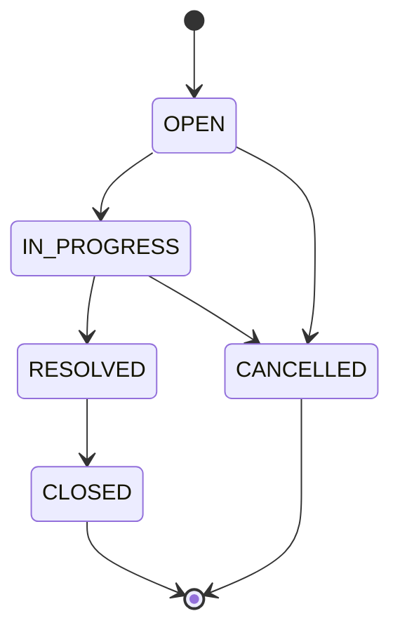

# Requirements — AI-Powered Support Ticket Management System
Status: Reviewed (rev 3 — open-question decisions recorded)
Traces to: source document "ATL / TL Assignment" (Assessments.pdf) — sections *Ask*, *Generic Artefacts*, *Application Requirements*, *RAG & Assistant Requirements*, *Grounding & Guardrails*, *Core Acceptance Criteria*

This file is the root of the spec tree. Every other `spec/*.md`, every task in `spec/tasks.md` and every test references the IDs defined here. This file states **what** is required, not how. Design lives in `spec/architecture.md` and the other spec files.

**Origin tags.** A requirement with no tag comes straight from the PDF. *(derived)* means we added it: it is not in the PDF, but it follows from a PDF requirement, a project rule, or an open-question default. Reviewers can cut a derived item without breaking a PDF requirement.

---

## 1. Glossary

| Term | Meaning |
|---|---|
| Ticket | A support request with title, description, priority, assignee, category, status, comments and (optionally) resolution notes. |
| Ticket key | Human-readable identifier, e.g. `TKT-1001`. This is what users and the assistant use to refer to a ticket. |
| Transition | A change of a ticket's status from one value to another. |
| Knowledge document / chunk | A searchable text unit built from ticket data, stored with metadata in the vector store. |
| Assistant | The `POST /api/ai/ask` question-answering feature. It does one retrieval and then one generation. |
| Grounded answer | A response with `grounded: true`: an answer built only from retrieved ticket context, citing ≥1 retrieved ticket. |
| No-match response | A response with `grounded: false`, a fixed "no relevant tickets found" message and an **empty** citation list. |

---

## 2. Functional requirements

### 2.1 Ticket management

| ID | Requirement | Source |
|---|---|---|
| FR-1 | A user can create a ticket from the UI with title, description, priority, category and an optional assignee (null = unassigned). A new ticket starts in status `OPEN`. Field constraints: §2.4. | "Create a ticket" |
| FR-2 | A user can list tickets. The list is paginated (default page size 20, max 100) and sorted by `createdAt` descending by default. | "List tickets" |
| FR-3 | A user can view one ticket's details: every field in §2.4, its current status and its comments. | "View ticket details" |
| FR-4 | A user can update a ticket's title, description and priority. *(derived)* Category is also editable (OQ-11 default), and so are resolution notes (OQ-1 default). Whether edits are allowed in terminal statuses: see OQ-3. | "Update title, description, priority and assignee" |
| FR-5 | A user can change a ticket's assignee, including setting it to unassigned. | "Update … assignee" / AC "Assignee can be changed" |
| FR-6 | A user can add a comment to a ticket, with a required author name (OQ-17). Whether comments can be edited or deleted: see OQ-6. | "Add comments" |
| FR-7 | A user can search tickets by keyword. What the keyword matches: see OQ-7. | "Search tickets by keyword" |
| FR-8 | A user can filter the ticket list by one status. The status filter and keyword search can be combined, and a ticket must then satisfy both (AND). | "Filter tickets by status" |
| FR-9 | A user can change a ticket's status. The change is accepted only if the state machine allows it (§4). The request body is `{ "targetStatus": "..." }` per `api-standards.md`. *(derived, OQ-1 default)* A move to `RESOLVED` also needs non-blank `resolutionNotes`, set beforehand with PATCH. If they are blank, the transition is rejected with 409. | "The following state machine must be enforced by the backend" |
| FR-10 | The backend rejects every transition not listed as allowed in §4, and leaves the ticket unchanged. | "Invalid transitions must be rejected" |
| FR-11 | The backend validates every input against §2.4 (required fields, lengths, enum values) and rejects invalid requests with 400 and field-level error details. Nothing is persisted from a rejected request. | "Validate input at the backend" |
| FR-12 | The UI shows a human-readable error message for validation failures (400, shown next to each field), not-found (404), rejected transitions (409) and unexpected / AI-unavailable errors (500 / 503). Raw stack traces or SQL are never shown. | "Display meaningful errors in the UI" |
| FR-13 | Ticket data (tickets, comments, status) is persisted in a relational database. | "Persist data in a database" |

### 2.2 Knowledge ingestion (RAG)

| ID | Requirement | Source |
|---|---|---|
| FR-14 | The system turns ticket information (title, description, comments, resolution notes) into knowledge documents, chunks them, generates embeddings and stores them in a vector store. | "Ingestion" / "Basic RAG Flow" |
| FR-15 | Every knowledge document carries the metadata `ticketId`, `status`, `priority`, `assignee`, `category`. | "Include metadata" |
| FR-16 | After a committed create, update, comment or status change (including closing), all chunks for that ticket are replaced so they match the committed ticket. This happens within **≤ 5 s** under normal operation. Chunks never contain uncommitted data. | "Re-ingest / refresh embeddings when a ticket is updated or closed" |

### 2.3 Assistant (question answering)

| ID | Requirement | Source |
|---|---|---|
| FR-17 | The system exposes `POST /api/ai/ask` with request body `{ "question": "<text>" }`. The response contract is defined in `spec/rag-api-contract.md`. | "API" |
| FR-24 | *(derived)* `question` is required and must be 3–500 characters after trimming. A missing, blank or out-of-range question returns 400 ProblemDetail, and neither the embedding model nor the LLM is called. | Follows from FR-11 |
| FR-18 | For a question, the system retrieves the most similar ticket chunks (similarity search) and generates an answer from them with an LLM. | "Basic RAG Flow" |
| FR-19 | The answer is grounded only in retrieved ticket context. The assistant must not fall back on general LLM knowledge for support questions. Measured by: NFR-10 thresholds. | "Grounding & Guardrails" |
| FR-20 | Every **grounded** answer (`grounded: true`) cites ≥1 ticket key. Every cited key must be in the retrieved set; the server validates this after generation. A no-match response has `grounded: false` and an empty citation list. | "Cite the specific ticket(s) used" |
| FR-21 | The system returns the no-match response, and does not produce a fabricated answer, when either (a) no retrieved chunk has a similarity ≥ `app.rag.similarity-threshold` (the LLM is not called), or (b) the LLM signals that the supplied context doesn't answer the question. "Out of scope" means exactly these two cases; there is no separate topic classifier. | "Explicitly indicate when no relevant tickets are found" |
| FR-22 | The assistant must handle the example question types below. "Handle" means meeting the NFR-10 thresholds on the golden dataset. | "Example Questions" |
| FR-23 | *(derived, OQ-8)* The UI has an "Ask" page. It shows the answer, the cited tickets (linked to their detail view) and a clearly marked no-match state. | Implied by "React frontend" + FR-17 |

**Example question types (FR-22)**

| # | Example | Retrieval need |
|---|---|---|
| Q1 | "Have we seen payment failures before?" | Semantic search by topic |
| Q2 | "What was the resolution for ticket TKT-1001?" | Lookup of one specific ticket by key |
| Q3 | "What are the common causes of shipment tracking issues?" | Summary across several tickets |
| Q4 | "Show me similar resolved tickets." | Status-constrained similarity (see OQ-4) |
| Q5 | "Which high-priority tickets are related to payment?" | Metadata constraint (priority) + topic (see OQ-5) |

### 2.4 Field constraints

These are the constraints FR-11 enforces. After trimming, a string of only whitespace counts as blank.

| Field | Required | Constraint |
|---|---|---|
| `title` | yes | 1–200 chars |
| `description` | yes | 1–5000 chars |
| `priority` | yes | enum (OQ-10) |
| `category` | yes | enum (OQ-10) |
| `assignee` | no | ≤ 100 chars; null = unassigned |
| `resolutionNotes` | no (see FR-9) | ≤ 5000 chars |
| comment `body` | yes | 1–2000 chars |
| comment `author` | yes | 1–100 chars |

---

## 3. Non-functional requirements

| ID | Requirement | Source |
|---|---|---|
| NFR-1 | Stack: Java 21, Spring Boot 3, Spring AI, PostgreSQL, an embedding model, a vector store (pgvector), REST API, React frontend. | "Exercise" |
| NFR-2 | Data survives an application restart. Tickets, comments and embeddings are all persisted; nothing is kept in memory only. | AC "Data survives application restart" |
| NFR-3 | The state machine is enforced in the backend domain layer. UI checks are only a convenience and are never the only check. | "must be enforced by the backend" |
| NFR-4 | Retrieval parameters (top-K, similarity threshold) are configurable through configuration, not hardcoded. Defaults: §3.1. | "Top-K and similarity threshold must be configurable" |
| NFR-5 | The chunking strategy (paragraph vs. fixed-size vs. semantic, for ticket data) and the embedding model choice (local vs. cloud, cost/latency/quality) are documented in `spec/architecture.md`. Each is a decision record listing the options considered, the choice made and the trade-offs. | "Retrieval Quality" |
| NFR-6 | No secrets (API keys, DB passwords) are committed. Secrets come only from environment variables. | AC "No secrets are committed" |
| NFR-7 | The assistant is a single retrieve → generate flow: one question, one grounded response. No autonomous agent, no tool/function definitions passed to the LLM, no side effects. | "Grounding & Guardrails" |
| NFR-8 | The static part of the assistant's system prompt (instructions, guardrails) is the first message and is the same on every request, so the provider's prompt caching can reuse it. Verified by a unit test on the prompt builder. | "Token Optimisation" |
| NFR-9 | The state machine has automated integration tests against a real PostgreSQL, covering every (from, to) pair. | AC "State-machine integration tests pass" |
| NFR-10 | Retrieval quality is tested against a seeded golden dataset (see `evaluation-strategy.md`). Thresholds: **retrieval hit@K ≥ 0.8** for in-scope questions (the expected ticket is among the top-K results, K = `app.rag.top-k`); **100 %** of citations in grounded answers are inside the retrieved set; **100 %** of out-of-scope questions get the no-match response; **0** injected instructions followed (NFR-13). | "How you test … probabilistic AI output" |
| NFR-11 | *(derived)* When the AI provider is unavailable, `/api/ai/ask` returns 503 ProblemDetail and ticket management keeps working. | Resilience; `api-standards.md` (503) |
| NFR-12 | *(derived)* The REST API is documented with OpenAPI / Swagger UI. | `.claude/rules/api-standards.md` |
| NFR-13 | *(derived)* Retrieved ticket text is treated as data. It is clearly delimited in the prompt, and the LLM must not follow any instructions inside it (e.g. "ignore previous instructions"). The golden dataset includes at least one ticket containing an injection attempt. | Follows from FR-19 + OS-1 (anyone can write ticket text) |

### 3.1 Configurable parameters

| Key | Default | Requirement |
|---|---|---|
| `app.rag.top-k` | 5 | NFR-4 |
| `app.rag.similarity-threshold` | 0.45 | NFR-4, FR-21 |

---

## 4. Ticket state machine

Statuses: `OPEN`, `IN_PROGRESS`, `RESOLVED`, `CLOSED`, `CANCELLED`. Initial status: `OPEN`. Terminal statuses: `CLOSED`, `CANCELLED`.

### 4.1 Full transition matrix

✅ = allowed · ❌ = rejected · ⚠ = same status (rejected under the OQ-2 default)

| From ↓ / To → | OPEN | IN_PROGRESS | RESOLVED | CLOSED | CANCELLED |
|---|---|---|---|---|---|
| **OPEN** | ⚠ | ✅ | ❌ | ❌ | ✅ |
| **IN_PROGRESS** | ❌ | ⚠ | ✅ | ❌ | ✅ |
| **RESOLVED** | ❌ | ❌ | ⚠ | ✅ | ❌ |
| **CLOSED** | ❌ | ❌ | ❌ | ⚠ | ❌ |
| **CANCELLED** | ❌ | ❌ | ❌ | ❌ | ⚠ |

**Allowed (5):** OPEN→IN_PROGRESS, IN_PROGRESS→RESOLVED (also needs resolution notes, FR-9), RESOLVED→CLOSED, OPEN→CANCELLED, IN_PROGRESS→CANCELLED.

**Rejected, different status (15):** every other pair between two different statuses. This includes the three the PDF names: CLOSED→OPEN, RESOLVED→OPEN, CANCELLED→OPEN. It also covers:
- skipping steps: OPEN→RESOLVED, OPEN→CLOSED, IN_PROGRESS→CLOSED
- going backwards: IN_PROGRESS→OPEN, RESOLVED→IN_PROGRESS
- cancelling after resolution: RESOLVED→CANCELLED
- any move out of a terminal status

**Same status (5, ⚠):** rejected under the OQ-2 default. If OQ-2 is decided differently, AC-10 and AC-14 change.

A rejected transition leaves the ticket unchanged and returns 409 per `api-standards.md`.

---

## 5. Acceptance criteria

The solution is complete when all of the following hold. Each item maps 1:1 to a PDF "Core Acceptance Criteria" bullet, in order.

| ID | Acceptance criterion (PDF wording) | Verifies |
|---|---|---|
| AC-1 | Ticket can be created from UI. | FR-1 |
| AC-2 | Tickets can be listed. | FR-2 |
| AC-3 | Ticket details can be viewed. | FR-3 |
| AC-4 | Ticket fields can be updated. | FR-4 |
| AC-5 | Assignee can be changed. | FR-5 |
| AC-6 | Comments can be added. | FR-6 |
| AC-7 | Search works. | FR-7 |
| AC-8 | Status filter works. | FR-8 |
| AC-9 | Valid status transitions work. | FR-9 |
| AC-10 | Invalid status transitions are rejected by backend. | FR-10, NFR-3 |
| AC-11 | Data survives application restart. | FR-13, NFR-2 |
| AC-12 | Backend validation works. | FR-11, FR-24 |
| AC-13 | UI shows meaningful errors. | FR-12 |
| AC-14 | State-machine integration tests pass. | NFR-9, FR-9, FR-10 |
| AC-15 | Ticket data is converted into embeddings and stored in a vector store. | FR-14, FR-15 |
| AC-16 | `POST /api/ai/ask` returns a grounded, ticket-sourced answer for in-scope questions. | FR-17, FR-18, FR-19, FR-22, NFR-10 |
| AC-17 | The response cites the specific ticket ID(s) used to generate it. | FR-20 |
| AC-18 | Out-of-scope / no-match questions return an honest "no relevant tickets found" response, not a fabricated answer. | FR-21, FR-19 |
| AC-19 | Chunking strategy and embedding model choice are documented and justified in `architecture.md`. | NFR-5 |
| AC-20 | Re-ingestion happens when a ticket is updated — embeddings do not go stale. | FR-16 |
| AC-21 | Retrieval parameters (top-K, similarity threshold) are configurable, not hardcoded. | NFR-4 |
| AC-22 | No secrets are committed. | NFR-6 |
| AC-23 | At least one meaningful AI mistake — in code or in a RAG answer — was caught and documented during development. | PR-3 |

### 5.1 Verifiable conditions per AC

These make each AC testable. The detailed test cases go in `spec/test-strategy.md`.

| AC | Pass condition |
|---|---|
| AC-1 | Filling the create form with valid data and submitting shows the new ticket with a key `TKT-<n>` and status `OPEN`. |
| AC-2 | The list shows the created tickets, paginated, newest first. |
| AC-3 | The detail view shows every §2.4 field, the status and the comments of the selected ticket. An unknown key returns 404. |
| AC-4 | After editing title/description/priority, re-reading the ticket returns the new values. |
| AC-5 | After changing the assignee (including to unassigned), re-reading the ticket returns the new value. |
| AC-6 | A posted comment appears on the ticket with its author and timestamp. |
| AC-7 | A keyword present in a ticket (per the OQ-7 default) returns that ticket. A keyword present in no ticket returns an empty list. |
| AC-8 | Filtering by a status returns only tickets in that status. Status + keyword returns only tickets matching both. |
| AC-9 | Each of the 5 allowed transitions in §4.1 succeeds and persists. RESOLVED is reached only when resolution notes are set. |
| AC-10 | Each of the 15 different-status rejected pairs in §4.1 returns 409 through the API, and the ticket status is unchanged. The 5 same-status pairs also return 409 *(depends on OQ-2)*. IN_PROGRESS→RESOLVED with blank resolution notes returns 409. |
| AC-11 | Tickets, comments and embeddings are still present after the app restarts. |
| AC-12 | Every §2.4 violation (missing/blank required field, over-length field, invalid enum value) returns 400 with field-level errors, and nothing is persisted. A blank or out-of-range `question` on `/ask` returns 400 (FR-24). |
| AC-13 | For 400/404/409/503, the UI shows a human-readable message, with field errors next to their fields for 400. No raw stack traces. |
| AC-14 | A parameterised integration test over all 25 (from, to) pairs (the 5 same-status results depend on OQ-2) passes against a real PostgreSQL. |
| AC-15 | After creating a ticket, the vector store contains chunk(s) for it with all FR-15 metadata. |
| AC-16 | For the in-scope golden questions (Q1–Q5 style), responses have `grounded: true`, a non-empty answer, and meet the NFR-10 hit@K threshold. |
| AC-17 | Every `grounded: true` response cites ≥1 ticket key, and every cited key is in the retrieved set. Every `grounded: false` response has an empty citation list. |
| AC-18 | For out-of-scope golden questions (e.g. "What is the capital of France?"), the response is the no-match response (`grounded: false`, no citations). When no chunk passes the threshold, the LLM is not called. |
| AC-19 | `spec/architecture.md` contains one decision record for chunking and one for the embedding model. Each lists the options considered, the choice made and its trade-offs. |
| AC-20 | Deterministic check: within 5 s of updating a ticket's field, adding a comment or changing its status, the vector store chunks for that `ticketId` contain the new text/metadata and none of the replaced text. |
| AC-21 | Changing top-K / threshold in config (or env) changes retrieval behaviour without a code change. |
| AC-22 | The repo contains no API keys or passwords. `.env` is git-ignored and `.env.example` holds only placeholders. |
| AC-23 | `docs/ai-mistakes-log.md` has ≥1 entry with evidence, how it was caught, and the fix. |

---

## 6. Process requirements

These describe how the system is built, not how it behaves.

| ID | Requirement | Source |
|---|---|---|
| PR-1 | Development follows Requirement → Specification → Plan/Tasks → Implementation → Testing → Review → Fix. Specs exist before the code they describe. | "Ask" |
| PR-2 | Every prompt to the AI coding assistant is saved in `docs/prompt-history.md` and `.specstory/history/`. | "Prompt History" |
| PR-3 | At least one meaningful AI mistake (wrong code **or** an ungrounded/hallucinated answer) is caught and recorded with evidence in `docs/ai-mistakes-log.md`. | "Important" |
| PR-4 | The repo keeps reusable AI steering files: Java/Spring Boot guidelines, testing guidelines, API standards, a documentation skill, RAG/vector-store guidelines, commands to review code and specs and to generate tests, and a command to review assistant output for hallucination. | "Generic Artefacts" |

---

## 7. Out of scope

| # | Item | Reason |
|---|---|---|
| OS-1 | Authentication, authorisation, user accounts, roles. Assignee and comment author are free-text names. | Not required by the PDF. Keeps the focus on RAG and the state machine. |
| OS-2 | Agent behaviour: multi-step reasoning, planning, tool/function calling, chaining into other tools. | PDF: "deliberately a single retrieval → generate flow, not an autonomous agent". |
| OS-3 | The assistant creating, updating or transitioning tickets. | PDF: taking further action like "creating tickets" is out of scope. The assistant is read-only. |
| OS-4 | The assistant (or the system) sending notifications — email, chat, webhooks. | PDF: "sending notifications … is out of scope". |
| OS-5 | Multi-turn conversation / chat memory. Each question is answered on its own. | "One question with one grounded response". |
| OS-6 | Answering from general LLM knowledge or external sources (web, docs). | FR-19. |
| OS-7 | Deleting tickets. (Editing or deleting comments: see OQ-6.) | Not asked for. |
| OS-8 | Attachments, SLAs, email-to-ticket, multi-tenancy, i18n. | Not asked for. |
| OS-9 | Production deployment, horizontal scaling, HA. | A locally runnable app is enough for the assessment. |

---

## 8. Open questions

Things the PDF leaves ambiguous. **Decided on 2026-09-25 by the project owner:** every proposed default was accepted except OQ-12, which was changed from asynchronous to synchronous re-ingestion. Every decision is *(derived)*.

| ID | Question | Decision | Affects |
|---|---|---|---|
| OQ-1 | Where do **resolution notes** come from? The PDF names them for ingestion but lists no requirement to enter them. | A `resolutionNotes` field, editable via PATCH (FR-4). A move to `RESOLVED` is rejected with 409 unless they are non-blank. The transition body stays `{ "targetStatus": "..." }`, so `api-standards.md` is unchanged. | FR-4, FR-9, FR-14, data-model |
| OQ-2 | Is a same-status "transition" (e.g. OPEN→OPEN) valid? | Rejected with 409. It is not in the allowed list. | §4, AC-10, AC-14 |
| OQ-3 | Can ticket fields still be edited in terminal statuses (`CLOSED`, `CANCELLED`)? Can comments be added? | Field edits are rejected with 409 in terminal statuses. Comments are still allowed on all statuses. | FR-4–FR-6 |
| OQ-4 | "Show me similar resolved tickets" — similar to **what**? There is no conversation context (OS-5). | Treat it as a topic query and filter on status `RESOLVED`/`CLOSED` when the question mentions resolved tickets. If the question has no topic, the normal FR-21 rules apply. No special fallback. | FR-22 Q4, rag-api-contract |
| OQ-5 | How are metadata constraints ("high-priority", "resolved") taken from the question? The LLM can't call tools (NFR-7). | Deterministic keyword rules on the question (e.g. "high priority" → `priority == HIGH`) applied as a vector-store filter before generation. No LLM call is used to extract the filter. | FR-22 Q4/Q5, NFR-7 |
| OQ-6 | Can comments be edited or deleted? | No — append-only. | FR-6, OS-7 |
| OQ-7 | What exactly does keyword search match: title only, title + description, or comments too? Case sensitivity? | Case-insensitive substring match on title and description. It is separate from the assistant's semantic search. | FR-7, AC-7 |
| OQ-8 | Is a UI for the assistant required? The ACs only name the API. | Yes, a simple "Ask" page (FR-23). The API remains the contract that is tested. | FR-23 |
| OQ-9 | What should `/api/ai/ask` return when the embedding or LLM provider is down? | 503 ProblemDetail. Ticket CRUD is not affected. Ingestion failures are logged and can be recovered by re-indexing (OQ-12). | NFR-11, FR-16 |
| OQ-10 | Allowed values for **priority** and **category**? The PDF gives none. | Priority: `LOW`, `MEDIUM`, `HIGH`, `CRITICAL`. Category: `PAYMENT`, `SHIPPING`, `ACCOUNT`, `TECHNICAL`, `OTHER`. Both required on create. | FR-1, FR-15, §2.4, data-model |
| OQ-11 | Is `category` editable? The PDF names only title/description/priority/assignee. | Editable (it is used in retrieval metadata). Otherwise a mis-categorised ticket could never be fixed. | FR-4, FR-16 |
| OQ-12 | Should re-ingestion be synchronous (part of the request) or asynchronous? What if it fails? | **Synchronous**, immediately after the DB commit, in the same request thread *(changed from the proposed async default: simpler code, deterministic tests, and the chunks are fresh by the time the response returns, so the FR-16 deadline is met trivially)*. A failure is logged, never rolls back the ticket change, and is repaired by the admin re-index endpoint. | FR-16, AC-20 |
| OQ-13 | Which statuses are searchable by the assistant — should `CANCELLED` tickets be answer sources? | All statuses are indexed. Status is in the metadata and in the chunk header, so the answer can say it. | FR-14, FR-18 |
| OQ-14 | What counts as "no relevant tickets"? | Settled in FR-21: nothing passes the threshold (LLM not called), or the LLM signals the context is insufficient. Both produce the no-match response defined in the glossary. | FR-21, NFR-4 |
| OQ-15 | Should the answer's cited tickets include snippets or only keys? | Key + title + status per cited ticket, so the UI can link to it. | FR-20, rag-api-contract |
| OQ-16 | How much seed data is needed for evaluation? | ~30 realistic seeded tickets across the categories, including payment-failure and shipment-tracking clusters and one prompt-injection ticket (NFR-13). | NFR-10, evaluation-strategy |
| OQ-17 | Who is the comment author without auth (OS-1)? | A free-text, required `author` field on the comment request (§2.4). | FR-6, OS-1 |

---

## 9. Traceability summary

| Requirement | Verified by |
|---|---|
| FR-1 | AC-1 |
| FR-2 | AC-2 |
| FR-3 | AC-3 |
| FR-4 | AC-4 |
| FR-5 | AC-5 |
| FR-6 | AC-6 |
| FR-7 | AC-7 |
| FR-8 | AC-8 |
| FR-9 | AC-9, AC-14 |
| FR-10 | AC-10, AC-14 |
| FR-11 | AC-12 |
| FR-12 | AC-13 |
| FR-13 | AC-11 |
| FR-14 | AC-15 |
| FR-15 | AC-15 |
| FR-16 | AC-20 |
| FR-17 | AC-16 |
| FR-18 | AC-16 |
| FR-19 | AC-16, AC-18, NFR-10 |
| FR-20 | AC-17 |
| FR-21 | AC-18 |
| FR-22 | AC-16, NFR-10 |
| FR-23 | No PDF AC — verified by a UI test in `test-strategy.md` |
| FR-24 | AC-12 |
| NFR-1 | Build / review |
| NFR-2 | AC-11 |
| NFR-3 | AC-10 |
| NFR-4 | AC-21 |
| NFR-5 | AC-19 |
| NFR-6 | AC-22 |
| NFR-7 | Code review (`/review-code`) + a test asserting no tool definitions are passed to the chat client |
| NFR-8 | Prompt-builder unit test |
| NFR-9 | AC-14 |
| NFR-10 | RAG eval suite (`mvn verify -Prag-eval`) |
| NFR-11 | Slice test with a failing AI client stub |
| NFR-12 | `/swagger-ui.html` reachable |
| NFR-13 | RAG eval injection case (NFR-10) |
| PR-1 | Git history (spec commits before code) |
| PR-2 | `docs/prompt-history.md` |
| PR-3 | AC-23 |
| PR-4 | Presence of `.claude/rules`, `.claude/commands`, `.claude/skills` |

---

## 10. Revision history

| Rev | Change |
|---|---|
| 1 | Initial draft from the PDF. |
| 2 | Applied `/review-spec` P1–P3:  • Fixed the AC-17/AC-18 citation contradiction (M-1).  • Gave FR-16 a ≤ 5 s freshness deadline.  • Resolution notes are now set via PATCH before RESOLVED.  • FRs no longer pre-decide open questions.  • Added FR-24 (question validation), NFR-13 (prompt injection), NFR-10 thresholds and §2.4 field constraints.  • Clarified FR-1/2/8/21 and made AC-20 deterministic.  • Tagged derived items.  • Moved process items to PR-1..PR-4 and added the PDF's steering-files requirement (PR-4). NFR-14/15 were renumbered to NFR-11/12.  • Fixed the AC-1 trace. |
| 3 | Open questions decided (all defaults accepted, OQ-12 changed to synchronous re-ingestion). Status → Reviewed. |
