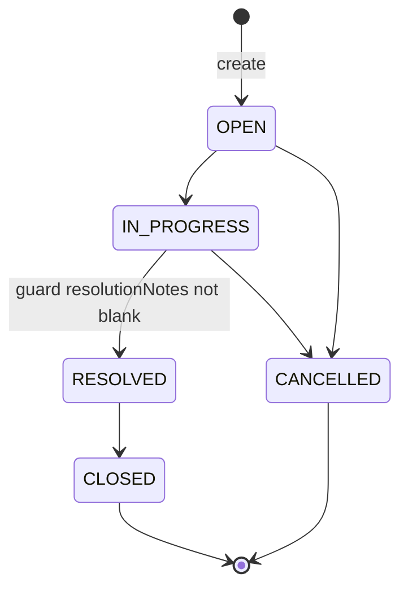

# Ticket State Machine
Status: Reviewed
Traces to: FR-9, FR-10, NFR-3, NFR-9, AC-9, AC-10, AC-14, OQ-1, OQ-2, OQ-3

The authoritative allowed/rejected matrix is `requirements.md` §4.1 (5 allowed, 15 rejected, 5 same-status rejected). This file defines how it is enforced.

## 1. Single source of truth

`TicketStatus` enum owns the transition table:

| From | Allowed targets |
|---|---|
| `OPEN` | `IN_PROGRESS`, `CANCELLED` |
| `IN_PROGRESS` | `RESOLVED`, `CANCELLED` |
| `RESOLVED` | `CLOSED` |
| `CLOSED` | — (terminal) |
| `CANCELLED` | — (terminal) |

- `boolean canTransitionTo(TicketStatus target)` — true only for the pairs above. A same-status pair is false (OQ-2).
- `boolean isTerminal()` — `CLOSED`, `CANCELLED`.
- No other class may contain transition rules; the UI only *displays* allowed next statuses as a convenience (NFR-3) and gets them from the API (`allowedTransitions` in the ticket response), not from its own copy.

## 2. Transition algorithm (`TicketService.transition(key, target)`)

Runs in one `@Transactional` method:

1. Load the ticket by key → `TicketNotFoundException` (404) if absent.
2. If `!current.canTransitionTo(target)` → `InvalidStatusTransitionException(key, current, target)` (409 `invalid-transition`). Nothing is changed.
3. If `target == RESOLVED` and `resolutionNotes` is null/blank → `ResolutionNotesRequiredException` (409 `resolution-notes-required`). Nothing is changed.
4. Set status, `updated_at`; save.
5. Publish `TicketChangedEvent(key)` → re-index after commit (ADR-4).

`targetStatus` values that are not enum names are a 400 (malformed request), not a 409.

## 3. Guards on other operations

| Operation | Rule | Error |
|---|---|---|
| `PATCH /tickets/{key}` in `CLOSED` or `CANCELLED` | rejected (OQ-3) | 409 `ticket-closed` |
| `PATCH` body containing `status` | unknown field → rejected; status changes only via `/transitions` | 400 |
| Add comment | allowed in every status (OQ-3) | — |
| Clearing `resolutionNotes` on a `RESOLVED` ticket | rejected — would break the RESOLVED invariant | 400 field error on `resolutionNotes` |

## 4. Concurrency

`ticket.version` (`@Version`). Two concurrent transitions on the same ticket: the second commit fails with an optimistic-lock error → 409 `concurrent-modification`. The client reloads and retries.

## 5. Test obligations (NFR-9, AC-14)

- Unit: `TicketStatus.canTransitionTo` for all 25 pairs (`@ParameterizedTest` over `requirements.md` §4.1).
- Integration (real PostgreSQL `tickets_test`, through the HTTP API): all 25 pairs. For each pair, the ticket is first driven to `from` via allowed transitions, then `to` is requested: allowed pairs → 200 and the new status persisted; every other pair → 409 and status unchanged.
- Guard tests: IN_PROGRESS→RESOLVED with blank notes → 409; PATCH on CLOSED → 409; PATCH with `status` → 400.
