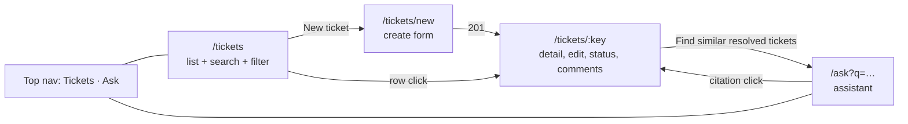

# UI Flow
Status: Reviewed
Traces to: FR-1..FR-12, FR-23, AC-1..AC-8, AC-13

React + Vite + TypeScript, React Router, plain `fetch`. No state library. The Vite dev server proxies `/api` to `http://localhost:8080`.

## 1. Routes

`/` redirects to `/tickets`.

## 2. Screens

### 2.1 Ticket list — `/tickets` (AC-2, AC-7, AC-8)
- Search box (submits on Enter or the Search button) → `q`.
- Status dropdown: All, OPEN, IN_PROGRESS, RESOLVED, CLOSED, CANCELLED → `status`.
- Table: key, title, status badge, priority, category, assignee ("Unassigned" when null), created.
- Previous / Next pagination with "Page x of y".
- Empty state: "No tickets match your search." Loading state while fetching.
- Search text, status and page are kept in the URL query string, so reload and back keep the view.

### 2.2 Create ticket — `/tickets/new` (AC-1, AC-12, AC-13)
- Fields: title, description (textarea), priority (select), category (select), assignee (optional).
- On 201 → navigate to `/tickets/{key}`.
- On 400 → each `errors[].message` shown under its field, plus a summary banner "Please fix the highlighted fields."
- Browser-side `required`/`maxLength` are a convenience only; server errors are always displayed.

### 2.3 Ticket detail — `/tickets/:key` (AC-3..AC-6, AC-9, AC-10, AC-13)
- Header: key, title, status badge, priority, category, created/updated.
- **Edit form** (title, description, priority, category, assignee, resolution notes) → PATCH only the changed fields; clearing assignee sends `""`. Disabled with the note "Closed and cancelled tickets can't be edited" when the status is terminal.
- **Status actions:** one button per entry in `allowedTransitions` (e.g. "Move to IN_PROGRESS"). No buttons for terminal statuses. A 409 is shown in a banner with the server's `detail` (e.g. "Add resolution notes before resolving").
- **Comments:** list (author, time, body), oldest first; add form with author + body.
- **Find similar resolved tickets** → `/ask?q=Show me similar resolved tickets about: <title>`.
- Unknown key (404) → "Ticket TKT-9999 was not found" with a link back to the list.

### 2.4 Ask — `/ask` (FR-23, AC-16..AC-18)
- Question textarea (pre-filled from `?q=`) + Ask button; disabled while waiting.
- **Grounded:** answer text; "Sources" list with one link per citation (`TKT-1001 · title · status`).
- **No match:** a visually distinct neutral panel with the fixed no-match message. Never styled as an error.
- **Retrieval details** (collapsed by default): top-K, threshold, filter, and matches with similarity scores.
- 400 → message under the textarea. 503 → "The AI assistant is unavailable right now. Ticket management still works."

## 3. Error display rules (FR-12, AC-13)

| Response | Shown as |
|---|---|
| 400 `validation-error` | message next to each field + summary banner |
| 400 `malformed-request` | banner with `detail` |
| 404 | "not found" message with a link back |
| 409 | banner with `detail` |
| 503 | assistant-unavailable banner |
| 500 / network failure | "Something went wrong. Please try again." (never a stack trace) |

All API calls go through one `api.ts` client that parses ProblemDetail into an `ApiError { status, title, detail, fieldErrors }`.
